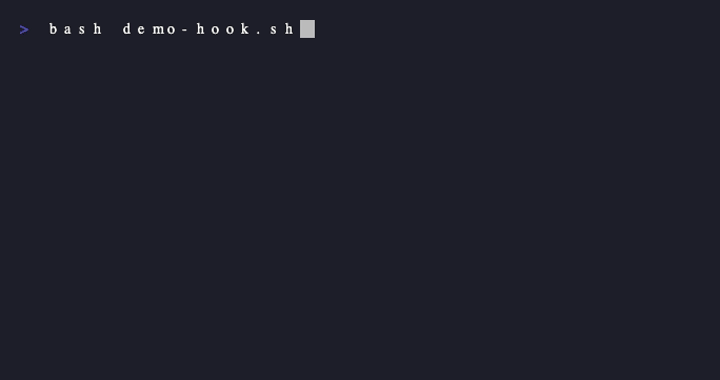

# Claude Code Sound Hooks

Add voice notifications to your [Claude Code](https://docs.anthropic.com/en/docs/claude-code) CLI workflow. Get audio feedback when Claude starts working, needs input, completes tasks, or hits errors.

**Bring your own sounds** — the engine handles weighted random selection, debounce, anti-repeat, and special flavor triggers. Ship it with Halo, Warcraft, Portal, Zelda, or whatever you want.

A Master Chief (Halo) theme guide is included to get you started.



## Features

- **Weighted random selection** — Primary sounds play ~40%, rotation ~50%, bonus/easter eggs ~5-10%
- **Smart debounce** — Global 2s cooldown, 30s for working sounds, 3s for prompt acknowledgments
- **Anti-repeat** — Never plays the same sound twice in a row per category
- **Flavor sounds** — Special triggers for first Bash command, error recovery, context compaction, subagent spawns
- **Kill-previous** — New events interrupt currently playing sounds
- **Volume control** — Default 60%, configurable via env var
- **Quiet mode** — Disable all sounds with one env var
- **Cross-platform** — macOS (`afplay`), Linux (`paplay`/`mpv`), with fallback chain
- **Theme system** — Swap sound packs by changing one config file

## Quick Install

```bash
git clone https://github.com/jfed789/claude-code-sound-hooks.git
cd claude-code-sound-hooks
./install.sh
```

The install script will:
1. Create the sound directory structure at `~/.claude/sounds/<theme>/`
2. Install the playback engine and theme config
3. Show you the hooks to add to your Claude Code settings

## Supported Hook Events

| Hook Event | Category | When It Fires | Example |
|---|---|---|---|
| `SessionStart` | `session_start` | Claude Code starts, resumes, or clears | "I need a weapon" |
| `UserPromptSubmit` | `prompt_submit` | You send a message | "Yes Sir" |
| `Notification` | `needs_input` | Claude needs permission or input | "Are you sure?" |
| `Stop` | `task_complete` | Claude finishes responding | "Sir, finishing this fight" |
| `PostToolUseFailure` | `error` | A tool call fails | *death grunt* |
| `PreToolUse` | `working` | Claude uses Bash/Write/Edit | "Do it" |
| `PreCompact` | `flavor_compact` | Context window getting full | "Let's stay focused" |
| `SubagentStart` | `flavor_subagent` | A subagent is spawned | "So, stay here" |

### Bonus Triggers

| Trigger | What Happens |
|---|---|
| First `Bash` command of session | Plays a special "weapon select" sound instead of normal working sound |
| Tool success right after a failure | Plays an "error recovery" sound ("You all right?") |

## Themes

### Master Chief (Halo)

The included theme maps Master Chief voice lines to Claude Code events. See **[themes/masterchief/README.md](themes/masterchief/README.md)** for:
- Where to download the sound files
- Complete file-to-hook mapping with priorities
- Step-by-step setup

### Create Your Own Theme

1. Copy `themes/masterchief/config.sh` as a starting point
2. Create your sound directory structure:

```
~/.claude/sounds/yourtheme/
├── session_start/    ← sounds for when Claude starts up
├── prompt_submit/    ← quick acknowledgment sounds
├── needs_input/      ← attention-getting sounds
├── task_complete/    ← satisfying completion sounds
├── error/
│   ├── instant/      ← quick error pings (main rotation)
│   ├── quiet/        ← subtle errors (optional)
│   └── violent/      ← dramatic errors (~10% chance)
├── working/          ← "on it" sounds (heavily debounced)
└── flavor/           ← special-trigger sounds
```

3. Edit your `config.sh` to set:
   - `THEME_NAME` — shown in terminal title
   - `PRIMARY_*` / `BONUS_*` — which files get weighted selection
   - `TITLE_*` — terminal title text per category
   - `FLAVOR_*` — special trigger sound filenames

4. Run `./install.sh yourtheme`

Sound files should be `.wav` format. Keep them short — 0.3s to 3s is the sweet spot. Longer sounds will get cut off by the next event.

## Configuration

| Env Variable | Default | Description |
|---|---|---|
| `CLAUDE_SOUND_VOLUME` | `0.6` | Playback volume (0.0 to 1.0) |
| `CLAUDE_SOUND_QUIET` | `0` | Set to `1` to disable all sounds |
| `CLAUDE_SOUND_DISABLE` | *(empty)* | Comma-separated categories to skip (e.g., `working,prompt_submit`) |

Add these to your shell profile (`~/.zshrc`, `~/.bashrc`) to persist:

```bash
export CLAUDE_SOUND_VOLUME=0.4        # quieter
export CLAUDE_SOUND_DISABLE=working   # skip the frequent PreToolUse sounds
```

## How It Works

Claude Code [hooks](https://docs.anthropic.com/en/docs/claude-code/hooks) let you run shell commands in response to lifecycle events. Each hook receives JSON on stdin with the event name, session ID, tool name, etc.

This project provides:
- **`play.sh`** — A bash script that reads the hook JSON, maps events to sound categories, picks a sound using weighted random selection, and plays it in the background
- **`config.sh`** — Theme-specific settings (which sounds are primary/bonus, terminal titles, flavor triggers)
- **`hooks.json`** — The Claude Code hooks configuration to wire it all up

The script is designed to be fast (sub-100ms) and never block Claude Code. Audio playback is always backgrounded, and the script exits immediately.

## Requirements

- **macOS** or **Linux**
- **bash** 3.2+ (macOS default works)
- **jq** — recommended for JSON parsing (falls back to grep if missing)
- An audio player: `afplay` (macOS, built-in), `paplay` (Linux/PulseAudio), or `mpv`

## Troubleshooting

**No sound plays:**
- Test manually: `echo '{"hook_event_name":"SessionStart","session_id":"test"}' | bash ~/.claude/sounds/masterchief/play.sh`
- Check that sound files exist in the right directories
- Verify `afplay` works: `afplay ~/.claude/sounds/masterchief/session_start/somefile.wav`

**Sounds play too often:**
- Increase debounce: edit `DEBOUNCE_WORKING` in config.sh
- Disable noisy categories: `export CLAUDE_SOUND_DISABLE=working,prompt_submit`

**Sounds cut off:**
- The kill-previous-sound feature interrupts old sounds when new events fire. This is intentional. Use shorter sound clips (under 2s) for frequently-firing categories.

**Hooks not triggering:**
- Restart Claude Code after editing `~/.claude/settings.json`
- Check `~/.claude/settings.json` is valid JSON (no trailing commas)

## Credits

- Sound engine and hook design by [@jfed789](https://github.com/jfed789)
- Built for [Claude Code](https://docs.anthropic.com/en/docs/claude-code) by [Anthropic](https://anthropic.com)
- Master Chief sound mapping inspired by the Halo franchise by Bungie/343 Industries/Microsoft
- Peon sound concept inspired by the [peon-ping](https://github.com/nicobailon/peon-ping) project

## License

MIT — see [LICENSE](LICENSE)
